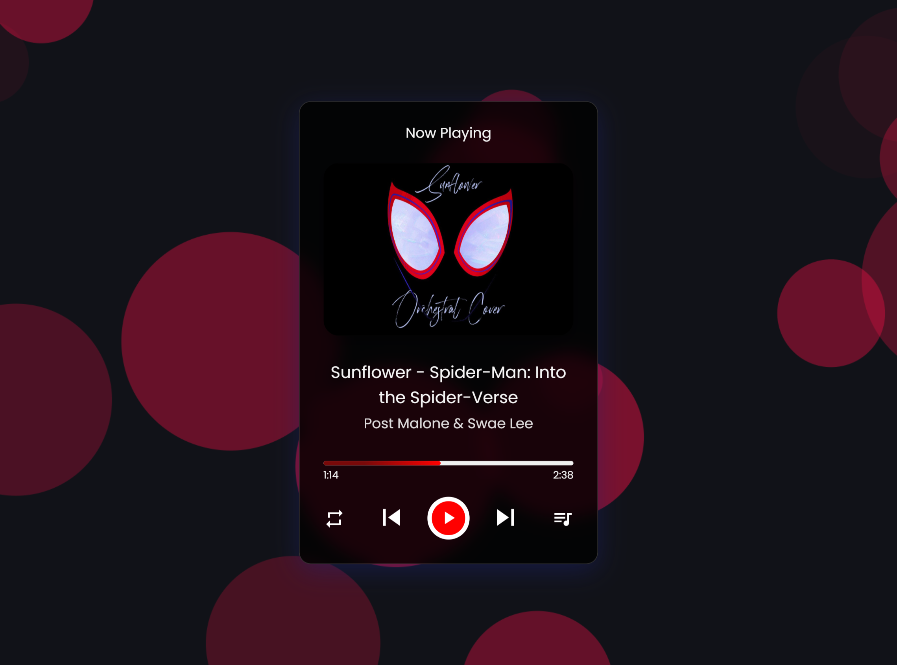

## MP3 Player

This is a simple HTML, CSS & JavaScript MP3 Player. This music player has several features like loop, repeat and shuffle songs, play/pause songs, and play next/prev songs. You can select songs from the preloaded list and also know which song is currently playing.

For icons, I have used [Material UI Icons](https://fonts.google.com/icons).
For the background, I have used [Particles.js](https://github.com/VincentGarreau/particles.js/) library.

Check it out [**here :globe_with_meridians:**](https://asmit2952.github.io/MP3-Player/)

